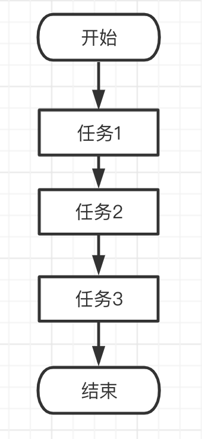
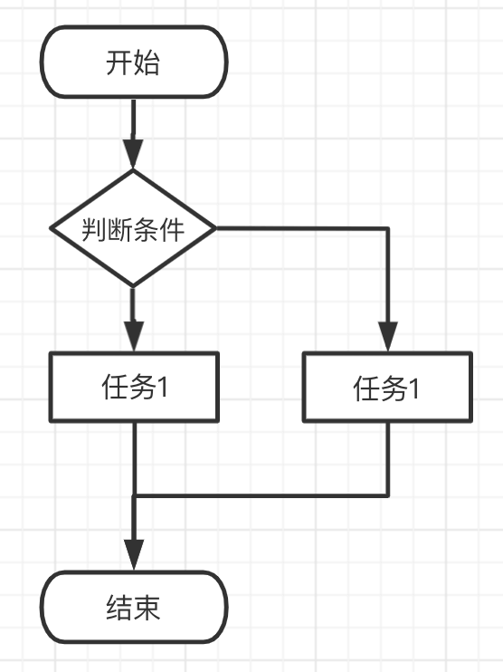
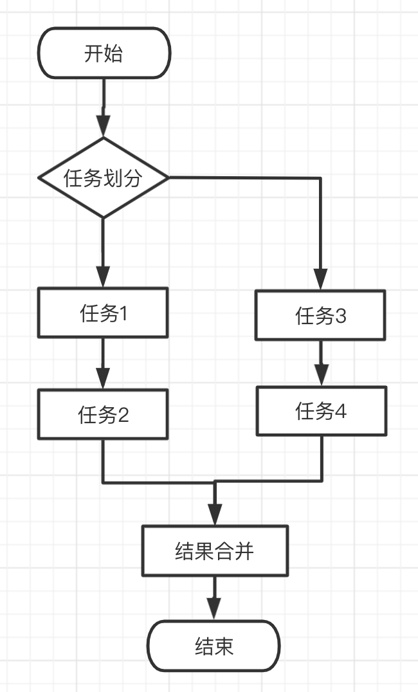
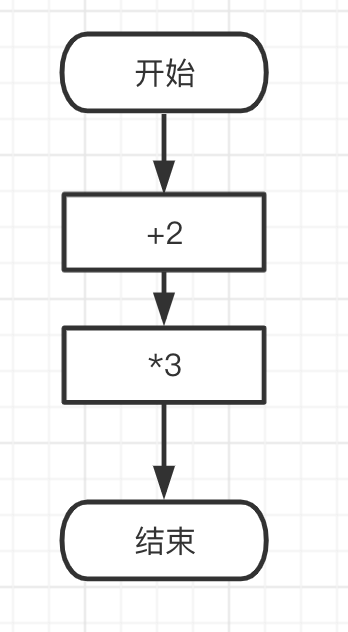

# pipeline
pipeline 是一个基于Golang 实现的统一流程引擎。

它支持流程的自定义构建和统一执行，目前支持的结构如下：

1、顺序结构



2、条件结构



3、归并结构



## 安装
````
go get -u -v github.com/caigoumiao/pipeline
````
推荐使用go.mod
<br>
````
require github.com/caigoumiao/pipeline latest
````

## 相关术语

### pipeline
在工厂生产中，原始物料经过一系列工序加工产出产品的过程称为一条流水线。

pipeline 也是流水线的模式，初始数据经过pipeline 中预定义的一系列任务流程的处理，最终产出结果。

一条流水线，一个pipeline，在程序中的结构以有向图来存储，表现为不同的节点以先后关系进行连接。
其中第一个节点一定是头节点，最后一个节点一定是尾节点。（头节点和尾节点是不需要自定义，是程序添加的虚拟节点）

### 节点 Node

节点有很多种类型，且每个节点都有一个name, name是节点的唯一标识，在添加节点时需要自定义。下面是支持的节点类型：

头节点 HeadNode
+ 头节点是流程开始执行的起点
+ 硬性规定：
    + 头节点的入度为0
    + 头节点的出度为1
    + 头节点的name固定为：head000

尾节点 TailNode
+ 尾节点是流程结束的终点，因此流程要结束必须指向尾节点
+ 硬性规定：
    + 尾节点的入度>=1
    + 尾节点的出度为0
    + 尾节点的name固定为：tail111
    
工作节点 WorkerNode
+ 工作节点是一个子任务执行的载体
+ 1输入：1输出
+ 工作节点name 需自定义
+ 硬性规定：
    + 工作节点入度=1
    + 工作节点出度=1

判断节点 JudgerNode
+ 判断节点对应着条件结构的条件
+ 1输入：1输出
+ 判断条件支持多出口，不只是是或否，所以判断条件的返回值是一个索引数字(pIndex)，
pIndex 即指示了数据经过条件判断后该执行的下一节点。
+ 判断节点name 需自定义
+ 硬性规定：
    + 判断节点入度=1
    + 判断节点出度>1
    
划分节点 DividerNode
+ 划分节点将一份数据分为多份，交给多个路径的流程继续执行
+ 1输入：n输出
+ 划分节点name 需自定义
+ 硬性规定：
    + 划分节点入度=1
    + 划分节点出度>1
    
合并节点 MergerNode
+ 合并节点将多个数据流程的数据合并成一份数据
+ n输入：1输出
+ 不要将判断节点的多流程指向合并节点，这是绝对错误，会导致程序无法正常执行
+ 合并节点name 需自定义
+ 硬性规定：
    + 合并节点入度>1
    + 合并节点出度=1
    
### 节点间关系
节点之间的关系指示了pipeline的执行顺序，以二维数组来表示：
```go
// 例如下面的edges数组则表示这样的执行顺序：
// head->节点a->节点b->tail
edges := []string{
    {"head000", "a"},
    {"a", "b"},
    {"b", "tail111"},
}
```

## 开始使用
1、构建pipeline
+ 初始化pipeline 管理器 Manager
+ 将需要用到的节点逐一添加
+ 添加节点之间的关系，并开始构建

```go
m := NewManager()
// 添加工作节点1
if err := m.AddWorkerNode("work1", func(ctx context.Context, in *rawData) (out *rawData, err error) {
    if a, ok := in.Data.(int); !ok {
        err = fmt.Errorf("type of in.Data is not int")
    } else {
        fmt.Println(a)
        in.Data = a + 2
        out = in
    }
    return
}); err != nil {
    t.Error(err)
    t.FailNow()
}
// 添加工作节点2
if err := m.AddWorkerNode("work2", func(ctx context.Context, in *rawData) (out *rawData, err error) {
    if a, ok := in.Data.(int); !ok {
        err = fmt.Errorf("type of in.Data is not int")
    } else {
        fmt.Println(a)
        in.Data = a * 3
        out = in
    }
    return
}); err != nil {
    t.Error(err)
    t.FailNow()
}
// 添加节点间关系，并开始构建
if err := m.BuildPipeline([][]string{
    {"head000", "work1"},
    {"work1", "work2"},
    {"work2", "tail111"},
}); err != nil {
    t.Error(err)
    t.FailNow()
}
```
上面的示例代码构建了一个顺序结构的pipeline, 输入a, 求解(a+2)*3的结果。示例图如下：



2、执行pipeline

```go
// 输入a
// 结果存在out 结构体中
var a = 3
out,err := m.Handle(&rawData{Data: a})
```

3、其他示例

带归并结构的示例：求解bool值：(a+2)*5 < (a+3)*4
```go
m := NewManager()
if err := m.AddDividerNode("divider1", func(ctx context.Context, in *rawData) (out []*rawData, err error) {
    out = append(out, in)
    out = append(out, &rawData{
        Data: in.Data,
    })
    return
}); err != nil {
    t.Error(err)
    t.FailNow()
}
if err := m.AddWorkerNode("w1", func(ctx context.Context, in *rawData) (out *rawData, err error) {
    if a, ok := in.Data.(int); !ok {
        err = fmt.Errorf("type of in.Data is not int")
        return
    } else {
        in.Data = a + 2
        out = in
        return
    }
}); err != nil {
    t.Error(err)
    t.FailNow()
}
if err := m.AddWorkerNode("w2", func(ctx context.Context, in *rawData) (out *rawData, err error) {
    if a, ok := in.Data.(int); !ok {
        err = fmt.Errorf("type of in.Data is not int")
        return
    } else {
        in.Data = a * 5
        out = in
        return
    }
}); err != nil {
    t.Error(err)
    t.FailNow()
}
if err := m.AddWorkerNode("w3", func(ctx context.Context, in *rawData) (out *rawData, err error) {
    if a, ok := in.Data.(int); !ok {
        err = fmt.Errorf("type of in.Data is not int")
        return
    } else {
        in.Data = a + 3
        out = in
        return
    }
}); err != nil {
    t.Error(err)
    t.FailNow()
}
if err := m.AddWorkerNode("w4", func(ctx context.Context, in *rawData) (out *rawData, err error) {
    if a, ok := in.Data.(int); !ok {
        err = fmt.Errorf("type of in.Data is not int")
        return
    } else {
        in.Data = a * 4
        out = in
        return
    }
}); err != nil {
    t.Error(err)
    t.FailNow()
}
if err := m.AddMergerNode("m1", func(ctx context.Context, in []*rawData) (out *rawData, err error) {
    if len(in) != 2 {
        err = fmt.Errorf("inData length wrong")
        return
    }
    out = &rawData{
        Meta: make(map[string]interface{}),
    }
    out.Meta["res"] = in[0].Data.(int) < in[1].Data.(int)
    return
}); err != nil {
    t.Error(err)
    t.FailNow()
}
if err := m.BuildPipeline([][]string{
    {"head000", "divider1"},
    {"divider1", "w1"},
    {"divider1", "w3"},
    {"w1", "w2"},
    {"w3", "w4"},
    {"w2", "m1"},
    {"w4", "m1"},
    {"m1", "tail111"},
}); err != nil {
    t.Error(err)
    t.FailNow()
}
var a = 1
if out, err := m.Handle(&rawData{
    Data: a,
}); err != nil {
    t.Error(err)
    t.FailNow()
} else {
    if !out.Meta["res"].(bool) {
        t.Errorf("wrong! res=false, ans=true")
    }
}
```

带判断结构的示例：

如果a<100则返回a+5, 如果100<=a<200, 则返回a*2, 否则抛出error。

```go
m := NewManager()
if err := m.AddJudgerNode("j1", func(ctx context.Context, in *rawData) (pipeIndex int) {
    a := in.Data.(int)
    if a < 100 {
        return 0
    } else if a < 200 {
        return 1
    } else {
        return 2
    }
}); err != nil {
    t.Error(err)
    t.FailNow()
}
if err := m.AddWorkerNode("w1", func(ctx context.Context, in *rawData) (out *rawData, err error) {
    if a, ok := in.Data.(int); !ok {
        err = fmt.Errorf("type of in.Data is not int")
        return
    } else {
        in.Data = a + 5
        out = in
        return
    }
}); err != nil {
    t.Error(err)
    t.FailNow()
}
if err := m.AddWorkerNode("w2", func(ctx context.Context, in *rawData) (out *rawData, err error) {
    if a, ok := in.Data.(int); !ok {
        err = fmt.Errorf("type of in.Data is not int")
        return
    } else {
        in.Data = a * 2
        out = in
        return
    }
}); err != nil {
    t.Error(err)
    t.FailNow()
}
if err := m.AddWorkerNode("w3", func(ctx context.Context, in *rawData) (out *rawData, err error) {
    err = fmt.Errorf("data out bound")
    return
}); err != nil {
    t.Error(err)
    t.FailNow()
}
if err := m.BuildPipeline([][]string{
    {"head000", "j1"},
    {"j1", "w1"},
    {"j1", "w2"},
    {"j1", "w3"},
    {"w1", "tail111"},
    {"w2", "tail111"},
    {"w3", "tail111"},
}); err != nil {
    t.Error(err)
    t.FailNow()
}
var a = 1
if out, err := m.Handle(&rawData{
    Data: a,
}); err != nil {
    t.Error(err)
    t.FailNow()
} else {
    if out.Data.(int) != 6 {
        t.Errorf("res=%d, trueAnswer=%d", out.Data.(int), 6)
        t.FailNow()
    }
    t.Log("test1 passed")
}

a = 150
if out, err := m.Handle(&rawData{
    Data: a,
}); err != nil {
    t.Error(err)
    t.FailNow()
} else {
    if out.Data.(int) != 300 {
        t.Errorf("res=%d, trueAnswer=%d", out.Data.(int), 300)
        t.FailNow()
    }
    t.Log("test2 passed")
}

a = 203
if _, err := m.Handle(&rawData{
    Data: a,
}); err == nil {
    t.Errorf("predict error occurs, but not")
    t.FailNow()
} else {
    t.Log("test3 passed")
    fmt.Println(err.Error())
}
```

## 其他问题
1、pipeline 是如何执行的？

2、pipeline 是如何构建的？

3、pipeline 是如何进行校验的？

## 致谢
相遇是缘！感恩🙏🙏🙏

如果你喜欢本项目或本项目有帮助到你，希望你可以帮忙 star 一下。

如果你有任何意见或建议，欢迎提 issue 或联系我本人。联系方式如下：
+ 微信：wo4qiaoba
